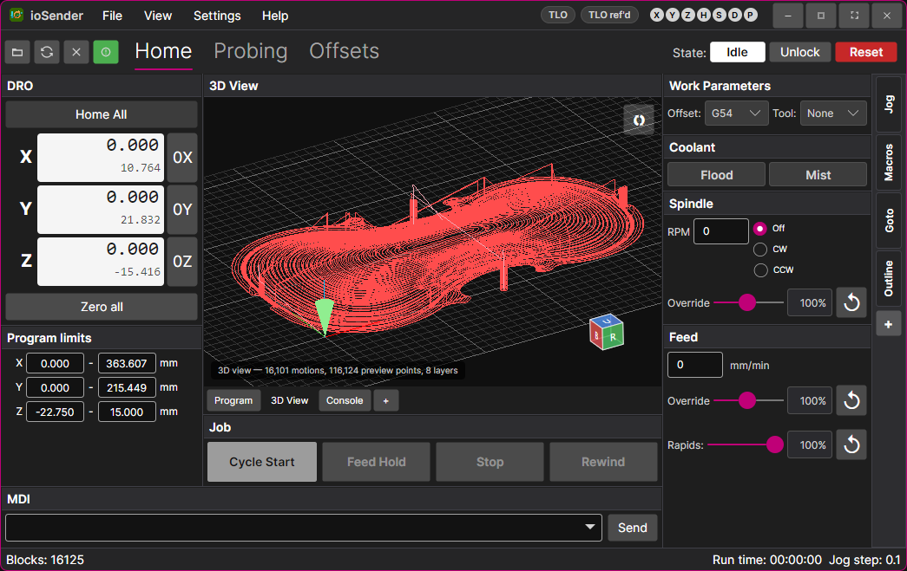
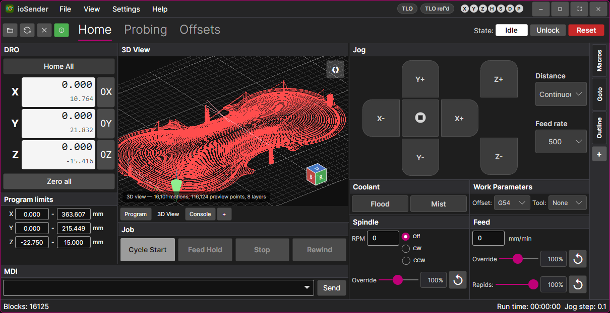
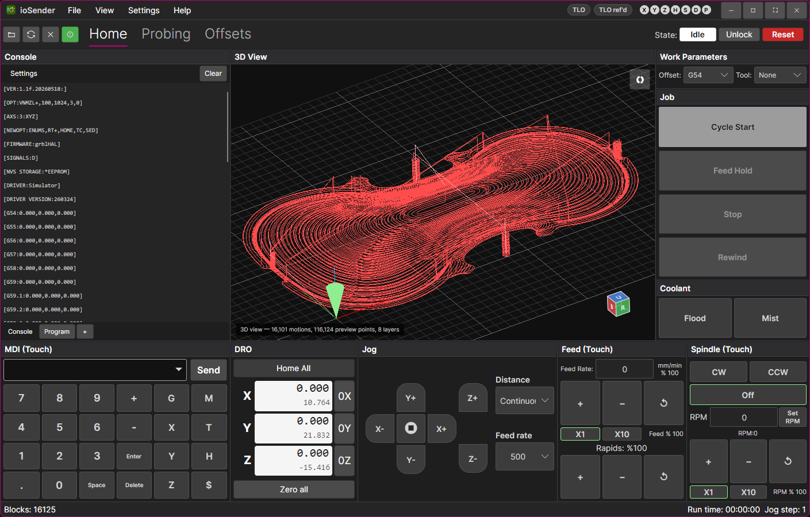

## ioSender - a gcode sender for grblHAL and Grbl controllers

---

### .NET 8 / Avalonia (Windows and Linux)

#### General

This repo is a UI conversion of the original ioSender application by [terjeino](https://github.com/terjeio/ioSender) so that it is build compatable and runnable in linux operating systems. Just getting this working and testing so there's likely some bugs to work out. 

Application layout is configurable and have a few default layouts: 

Main screen.

XL Layout

Touch Layout (inspired by [ioSenderTouch](https://github.com/Jay-Tech/ioSenderTouch))

