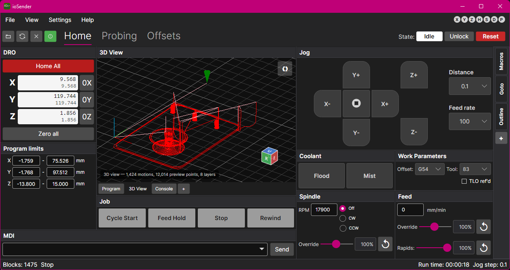
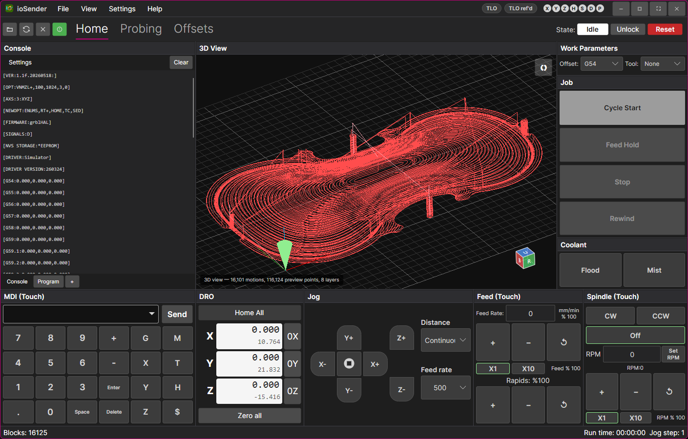

## ioSender - a gcode sender for grblHAL and Grbl controllers

---

### .NET 8 / Avalonia (Windows and Linux)

Cross-platform build: `ioSender.net.sln` at the repository root.

#### Release build (Windows)

From the repo root, double-click [`build-release.cmd`](build-release.cmd) or run:

```batch
build-release.cmd
```

**Prerequisites**

- [.NET 8 SDK](https://dotnet.microsoft.com/download/dotnet/8.0)
- [Inno Setup 6 or 7](https://jrsoftware.org/isinfo.php) (Windows installer)
- WSL + Ubuntu (Linux `.deb` only)

**Targets**

| Menu / `-Target` | Output |
|------------------|--------|
| `All` (default) | portable `.zip`, setup `.exe`, `.deb` |
| `WinPortable` | `artifacts\ioSender-<version>-win-x64-portable.zip` |
| `WinInstaller` | `artifacts\ioSender-Setup-<version>-win-x64.exe` |
| `LinuxDeb` | `artifacts\iosender_<version>_amd64.deb` |

**Examples**

```batch
build-release.cmd -Target WinPortable -NoPause
build-release.cmd -Target All -Launch
build-release.cmd -Target LinuxDeb -WslDistro Ubuntu-24.04
```

Flags: `-Launch` runs the published app after a successful build; `-NoExplorer` skips opening the artifacts folder; `-Verbose` prints full build logs.

Build logs are written under `artifacts\`. Linux packaging details: [`docs/LINUX.md`](docs/LINUX.md).

Each run cleans `bin`/`obj`, publish folders, and deb staging, then restores and rebuilds from the current source (no reuse of prior publish output).

#### General

This repo is a UI conversion of the original ioSender application by [terjeino](https://github.com/terjeio/ioSender) so that it is build compatable and runnable in linux operating systems. Just getting this working and testing so there's likely some bugs to work out. 

Application layout is configurable and have a few default layouts: 

Main screen.


XL Layout



Touch Layout (inspired by [ioSenderTouch](https://github.com/Jay-Tech/ioSenderTouch))


